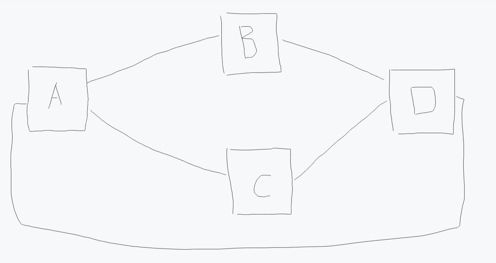

# 核心数据类型

## 零、概述

若有如下图的数据需要被创建:

假设图中 4 个元器件共分为三种类型，其中 B、C 是同一类型的。

创建核心数据流程如下:

- 第一步创建 3 个 `NodeProto` 分别对应

  - A 的元器件(取名 protoA)
  - B、C 的元器件(取名 protoBC)
  - D 的元器件(取名 protoD)

- 第二步创建 `Port`, 根据图中的关系可以看出 protoA 有一个输入端口，两个输出端口，便为 protoA 创建 portA1 为 INPUT 类型 port，再创建 portA2, portA3 为 OUTPUT 类型 port。同理再为 protoBC 和 protoD 也依照此流程创建 port。

- 第三步创建 `Node`, 创建 NodeA，NodeB，NodeC，NodeD 分别对应图中四个节点，创建他们时，只需要传入关联的 `NodeProto` 即可。

- 第四步创建 `Edge`, 根据图中的关系可以看到连接 NodeA 和 NodeB 的 `Edge` 的起点位置是 `NodeA`+`portA2`,终点位置是 `NodeB`+`portB1`, 使用这两个位置信息即可创建一条 `Edge`, 其他 `Edge` 同理。

## 一、节点模板 NodeProto

> 创建一个 `NodeProto` 的必要数据：名称，宽度，高度，唯一 id。

`NodeProto` 是 `node` 的模板，来自同一个 `NodeProto` 的 `Node` 都有相同的 `Port` 且这些 `Port` 的顺序也是相同的。

`NodeProto` 是一个抽象概念，但是需要用户进行定义。

## 二、节点实例 Node

> 创建一个 `Node` 的必要数据: 所属 `NodeProto` 的 id，名称，唯一 id。

`Node` 依赖 `NodeProto` 生成，每一个 `Node` 对应最后图数据中的一个节点实例。

## 三、连接端口 Port

> 创建一个 `Port` 的必要数据: 所属 `NodeProto` 的 id，名称，`Port` 类型， 唯一 id。

`Port` 是挂载在 `NodeProto` 上的端口数据, 其中 `Port` 类型可以分为 INPUT 和 OUTPUT。

INPUT 类型的 `Port` 只能作为 `Edge` 的终点，同理 OUTPUT 类型的 `Port` 只能作为 `Edge` 的起点。

且 INPUT 类型的 `Port` 固定在 `NodeProto` 左侧，OUTPUT 类型的 `Port` 固定在 `NodeProto` 右侧。

## 四、连接关系 Edge

> 创建一个 `Edge` 的必要数据: 起点 `Node` 指针或 id，起点 `Port` 指针或 id，终点 `Node` 指针或 id，终点 `Port` 指针或 id。

`Edge` 是两个 `Node` + `Port` 之间的连线，表示在图数据中两个 `Port` 的连接关系。

在执行完算法后，一个 `Edge` 会由一条或多条平行于 X 轴或 Y 轴的线段组成。

::: warning 为什么 Edge 需要同时关联 Node 和 Port？
`Port` 数据是关联在 `NodeProto` 上的，而 `NodeProto` 是一个抽象概念，无法对应最终图数据上的节点。

所以图数据中一个 `Port` 的实例需要 `Node` + `Port` 的数据来进行定位。

而 `Edge` 需要表现在图数据中，所以他关联的起点 Port 和终点 Port 也需要用 `Node` + `Port` 的数据来进行定位。
:::
