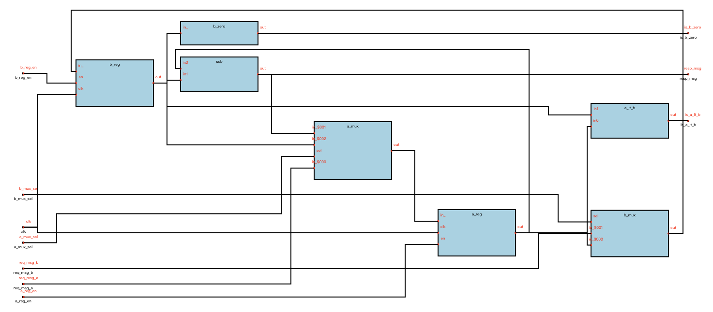

# 项目简介

`raina-schematic`(https://github.com/raina-rise/schematic) 是一个 EDA 领域中计算 schematic 布局布线的相对最优解的工具。

## 一、目标是什么

`raina-schematic` 的目标是接受 **不具备位置信息** 的原始数据后，根据连接关系，生成足以描述出如下视图的数据:

其中必要的原始数据包括 `节点(Node)`, `端口(Port)`, `连接(Edge)`。 

## 二、限制条件

`raina-schematic` 生成数据时会遵守以下条件:

1. **图的布局方向是从左到右的**
2. **所有 Edge 在 Node 上都遵循左进右出的原则**
3. **Port 在最后的图中的表示只有一个坐标点，没有尺寸**

## 二、 指标

判断程序优劣的指标主要有

1. 连接线交叉数
2. 连接线拐弯数
3. 视觉效果

其中1,2条可以通过统计迅速进行判断，第三条比较抽象，但业界也有相关的bp可以进行参考。